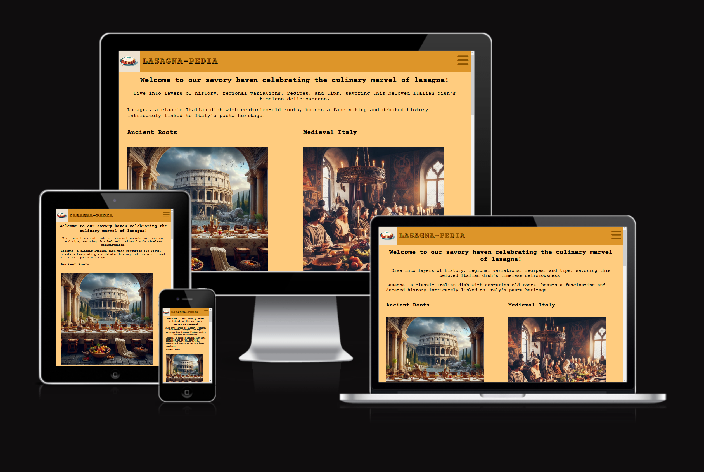

# Lasagna-pedia

[Visit the live website link](https://claudiosarto.github.io/lasagna-pedia/index.html)

 

Lasagna-pedia is a site dedicated to one of the most appreciated Italian pasta plates in the world (ranked in top 10) - Lasagna.
The site aim to give a background history on when and how this plate is born and evolved during history. 
It will be also usefut to home chefs as it has the traditional recipe for make it by yourself in your kitchen.

## Features

### Existing Features

 __Navigation Bar__  
    This structure provides clear and straightforward navigation links for users to easily find their way through the sections of the website and it's embeeded in each page for easy navigation.

 __Landing Page__  
    Page dedicated to welcoming the user on the website and give an historical overview on the product (Lasagna)
    

 __Recipe__  
    Page contain ingredients and instructions to make Lasagna at home following the traditional recipe. 
    

 __Contact__  
    This page provide a contact form with name, last name, email and textarea.
    

 __Footer__  
    The footer, like the navigation bar is implemented in all the pages. It has links to social media contacts.
    

### Future Features left to Implement

- Add additional recipe variations (e.g. vegetarian version, lactose intolerant version, etc)
- Add search box to find your favorite recipe
- Add a meetup for cooking together
- Add a "Learn how to prepare your lasagna" course
- Add a "where to buy" all the proper ingredients
- Evolve the site to a full eCommerce to sell all the different variations

## Design  

### UX Design  
A "mobile-first" approach has been used for design the site so initially for mobile devices, prioritizing functionality and user experience on smaller screens. Then using media query function to increase fonts and arrange the content for bigger screens. 

### Wireframes
Wireframes created for mobile, tabled and desktop.

 

### Color Scheme

Color scheme has been defined using [Paletton](https://paletton.com/) tool

- Header and footer background: `#DD9529`
- Header and footer font/icons color: `#8C5400`
- Content background color for all pages: `#FFCC7F` 

## Deployment

### Technologies used

### Github

## Testing  
Please refer to  page for the performed tests.

### Content  

- History page has been generated with the help of [ChatGPT](https://chat.openai.com/). Content has been checked for antiplagiarism on using [Quetext](https://www.quetext.com/), report available at this [link](https://www.quetext.com/results/335349786683fe3a0f42) 
- Recipe page has been generated with the help of [ChatGPT](https://chat.openai.com/) and tuned to reflect what I generally cook by myelf, although the recipe can vary from region to region. Content has been checked for antiplagiarism on using [Quetext](https://www.quetext.com/), report available at this [link](https://www.quetext.com/results/412b3c17cbec008cda94)
- All media used have been generated using GenAI embedded in [Microsoft Designer](https://designer.microsoft.com/) - [T&C](https://designer.microsoft.com/termsOfUse.pdf)
- Icons from [Font Awesome](https://fontawesome.com/)
- Fonts from [Google Fonts](https://fonts.google.com/)

### Credits

- Inspiration for the layout from the walthrough project "love Running" from Code institute
- Some CSS tecniques (e.g. basic styling on html and body elements) have been reused from walkthrough project "Grand Hotel" from [Udemy - CSS Bootcamp - Master CSS (CSS Grid / CSS Flexbox)](https://www.udemy.com/course/css-bootcamp-master-in-css-including-css-grid-flexbox/) 
- Readme structure/approach from [The Quiz Arms ](https://github.com/kera-cudmore/TheQuizArms/blob/main/README.md)
- Images converted to webp format with [Birme](https://www.birme.net/)
- [W3Schools](https://www.w3schools.com/) and [Stack Overflow](https://stackoverflow.com/) for troubleshooting/undersanding some tricky HTML/CSS features

### Acknowledgments

Special thanks to my mentor Jubril Akolade for giving me hints and tips during the project.

