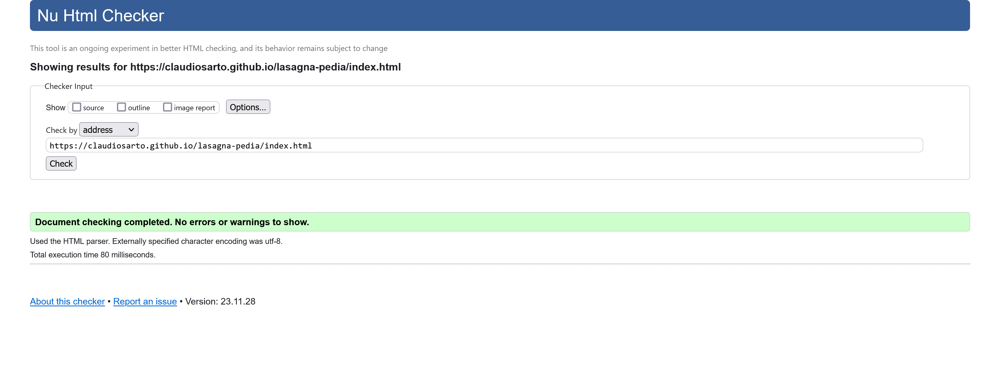
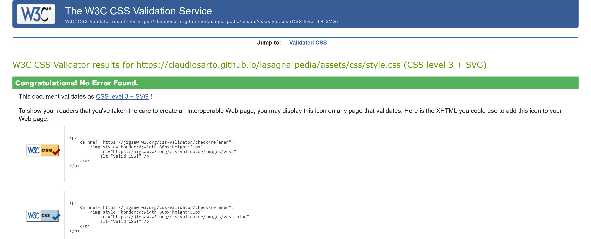
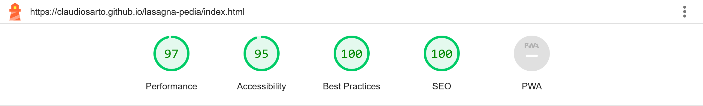
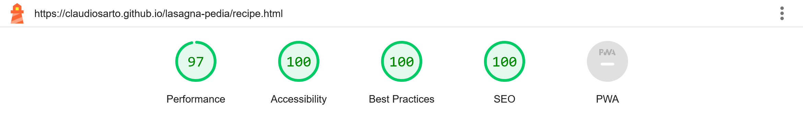
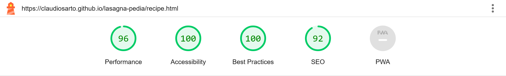
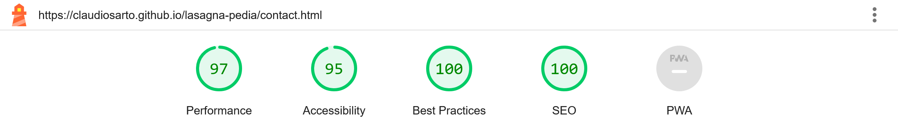

# Lasagna-pedia Testing

## Automated Tests

## HTML/CSS Validation

I used [W3C HTML](https://validator.w3.org/) validator to verfiy HTML compliance. No errors found.

Index Page:

-
Recipe Page:

-
Contact Page:

 
-

I used [W3C CSS](https://jigsaw.w3.org/css-validator/) validator to verfiy CSS compliance. No errors found.
 

### Lighthouse Performance

I used Lighthouse tool integrated in Chrome Developer to verify the performance, accessibility, best practices and SEO for all the website pages.

### Desktop Results

  
  
  

### Mobile Results

  
  
  

## Manual Tests

Testing performed on the following devices:
- Laptop:
    - Dell Latitude 15" screen

- Mobile devices:
    - Samsung A51
    - iPhone 14

- Browsers tested on each device:
    - Google Chrome
    - Firefox
    - Microsoft Edge (Laptop only)

#### Home Page

| Feature | Expected Outcome | Testing Performed | Result | Pass/Fail |
|---|---|---|---|---|
| Navbar Open (Mobile) | Navbar appears | Click the top right 3 lines | Navigation bar appears | Pass |
| Navbar Close (Mobile) | Navbar disappears | While Navbar is opened, click the 3 top right corner lines | Navigation bar disappears | Pass |
| Navbar Home (Mobile) | Home Page Reload | Clock "Home" link from navbar | Home page reloads | Pass |
| Navbar Recipe (Mobile) | Open Recipe page | Click "Recipe" link from navbar | Recipe page opens | Pass |
| Navbar Contact (Mobile) | Open Contact page | Click "Contact" link from navbar | Contact page opens | Pass |
| Navbar Home (Desktop) | Home Page Reload | Clock "Home" link from navbar | Home page reloads | Pass |
| Navbar Recipe (Desktop) | Open Recipe page | Click "Recipe" link from navbar | Recipe page opens | Pass |
| Navbar Contact (Desktop) | Open Contact page | Click "Contact" link from navbar | Contact page opens | Pass |
| External link recipe | Open Giallo Zafferano recipe | Click on the link at the end of the page | Giallozafferano site open in a separate tab | Pass |
| Footer Social Media Links | Open related social media page | Check every social media link opening in a new tab | All links open respective social media site in a separate tab | Pass |
| Footer Mouse Hover on Social Media Icons (Desktop) | Icons change color | Hover on every social media link opening in a new tab | Each icon change color when hovering mouse | Pass |

#### Recipe Page

| Feature | Expected Outcome | Testing Performed | Result | Pass/Fail |
|---|---|---|---|---|
| Navbar Open (Mobile) | Navbar appears | Click the top right 3 lines | Navigation bar appears | Pass |
| Navbar Close (Mobile) | Navbar disappears | While Navbar is opened, click the 3 top right corner lines | Navigation bar disappears | Pass |
| Navbar Home (Mobile) | Open Home Page | Clock "Home" link from navbar | Home page opens | Pass |
| Navbar Recipe (Mobile) | Reload Recipe page | Click "Recipe" link from navbar | Recipe page reloads | Pass |
| Navbar Contact (Mobile) | Open Contact page | Click "Contact" link from navbar | Contact page opens | Pass |
| Navbar Home (Desktop) | Open Home Page | Clock "Home" link from navbar | Home page opens | Pass |
| Navbar Recipe (Desktop) | Reload Recipe page | Click "Recipe" link from navbar | Recipe page reloads | Pass |
| Navbar Contact (Desktop) | Open Contact page | Click "Contact" link from navbar | Contact page opens | Pass |
| Footer Social Media Links | Open related social media page | Check every social media link opening in a new tab | All links open respective social media site in a separate tab | Pass |
| Footer Mouse Hover on Social Media Icons (Desktop) | Icons change color | Hover on every social media link opening in a new tab | Each icon change color when hovering mouse | Pass |

#### Contact Page

| Feature | Expected Outcome | Testing Performed | Result | Pass/Fail |
|---|---|---|---|---|
| Navbar Open (Mobile) | Navbar appears | Click the top right 3 lines | Navigation bar appears | Pass |
| Navbar Close (Mobile) | Navbar disappears | While Navbar is opened, click the 3 top right corner lines | Navigation bar disappears | Pass |
| Navbar Home (Mobile) | Open Home Page | Clock "Home" link from navbar | Home page opens | Pass |
| Navbar Recipe (Mobile) | Open Recipe page | Click "Recipe" link from navbar | Recipe page opens | Pass |
| Navbar Contact (Mobile) | Reload Contact page | Click "Contact" link from navbar | Contact page reloads | Pass |
| Navbar Home (Desktop) | Open Home Page | Clock "Home" link from navbar | Home page opens | Pass |
| Navbar Recipe (Desktop) | Open Recipe page | Click "Recipe" link from navbar | Recipe page opens | Pass |
| Navbar Contact (Desktop) | Reload Contact page | Click "Contact" link from navbar | Contact page reloads | Pass |
| Footer Social Media Links | Open related social media page | Check every social media link opening in a new tab | All links open respective social media site in a separate tab | Pass |
| Footer Mouse Hover on Social Media Icons (Desktop) | Icons change color | Hover on every social media link opening in a new tab | Each icon change color when hovering mouse | Pass |
| Input form - Mandatory fields | Form Cannot be submitted  | Leave any of the mandatory fields (First Name, Email, Message) empty and click submitt | "Please fill out this field" message is given | Pass |
| Input form - Email field | Check email is valid | Fill email field with wrong input and click submit | "Please enter an email address" message is given | Pass |
| Input form - Submit | Open the CI form check in another page | After all the fields are compiled correctly, click submit button | Code Institute Returned form data page open in another tab | Pass |
| Input form - Reset | All input fields are cleared | After all the fields are compiled correctly, click reset button | All fields are reset | Pass |
